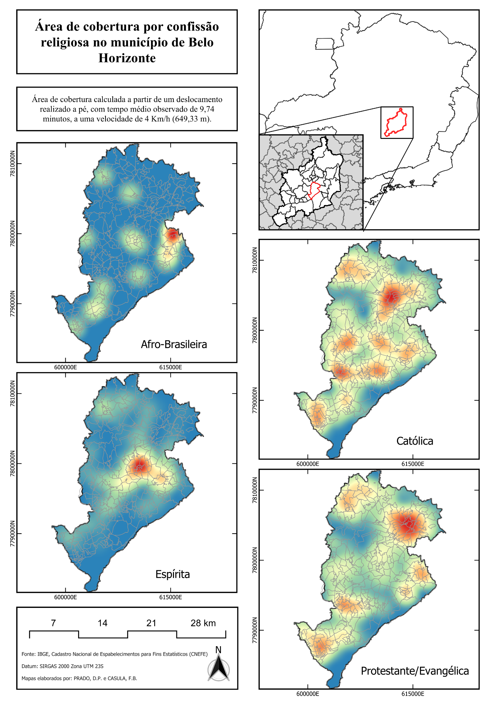
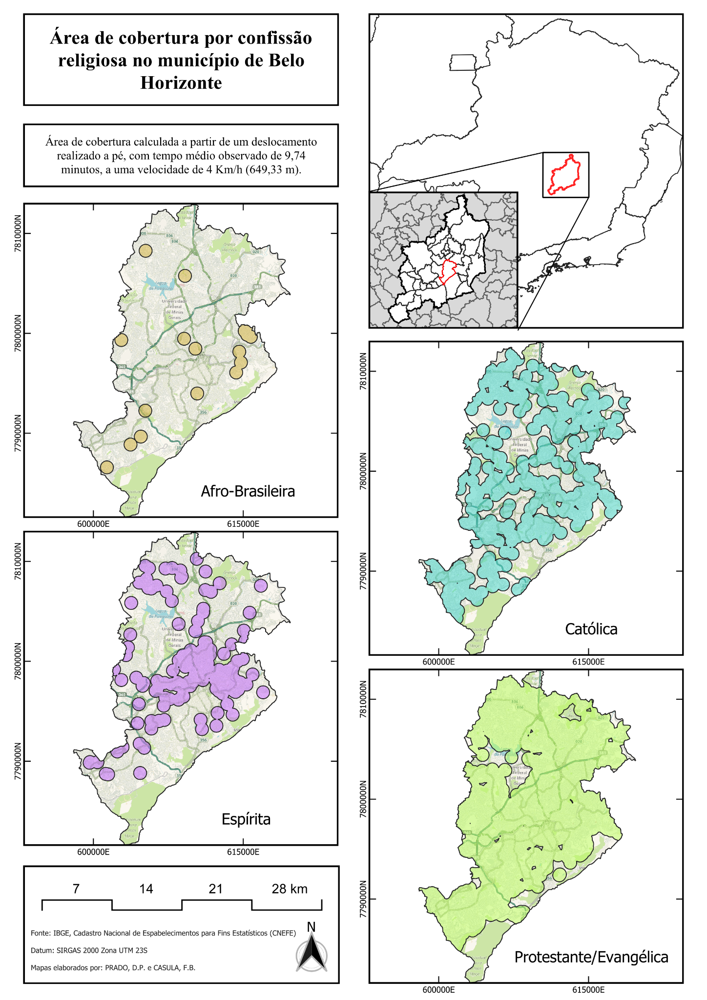

[Volver al sitio](index.qmd){.btn .btn-primary}
[Versão em português](../apresentacao-pt.qmd){.btn .btn-outline-primary}
[Abrir el tablero ICR](https://fecasula.shinyapps.io/religiao-mobilidade-bh/){.btn .btn-outline-primary target="_blank"}

## Pregunta

¿Cómo pueden las movilidades religiosas de las personas mayores informar el análisis espacial de la cobertura de los lugares de culto?

## Estrategia metodológica

1. Descripción de 86 desplazamientos religiosos.
2. Modelos logísticos acumulativos.
3. Clasificación de 3.848 establecimientos religiosos.
4. Estimación de cobertura y publicación de un tablero interactivo.

## Hallazgos principales

- 51,16% de los desplazamientos los domingos;
- 66,28% a pie;
- 9,7 minutos de caminata media;
- 76% dentro del barrio de residencia.

## Modos de transporte

{fig-alt="Distribución por modo de transporte" height=580}

## Compañía

{fig-alt="Distribución por compañía" height=580}

## Índice

\[
ICR_c=\frac{\sum_s P_s(A_{sc}/A_s)}{\sum_s P_s}
\]

El índice estima cobertura potencial por confesión, sin doble conteo dentro de la misma confesión.

## Auditoría

Con 4 km/h y 9,7 minutos, el radio consistente es 646,67 m. El proyecto conserva los valores históricos para comparación y adopta el cálculo consistente como predeterminado.

## Concentración de equipamientos (kernel)

El mapa de kernel muestra dónde la presencia de establecimientos es más intensa por confesión.

{fig-alt="Mapa de kernel por confesión religiosa en Belo Horizonte" height=700}

## Grado de cobertura por confesión

El mapa de cobertura muestra el alcance potencial de la red religiosa según la parametrización peatonal adoptada.

{fig-alt="Mapa del grado de cobertura por confesión religiosa en Belo Horizonte" height=700}

## Tablero interactivo

[Abrir el tablero del ICR](https://fecasula.shinyapps.io/religiao-mobilidade-bh/){.btn .btn-primary .btn-lg target="_blank"}

## Producto abierto

Sitio bilingüe · presentación Reveal.js · tablero Shiny · código R · pipeline · pruebas · guía de réplica.

**Tablero:** <https://fecasula.shinyapps.io/religiao-mobilidade-bh/>  
**Sitio:** <https://fecasula.github.io/espa-o-religiao-bh/>  
**Código:** <https://github.com/fecasula/espa-o-religiao-bh>

## Navegación rápida

[Volver al sitio](index.qmd){.btn .btn-primary}
[Versão em português](../apresentacao-pt.qmd){.btn .btn-outline-primary}
[Resultados en el sitio](resultados.qmd){.btn .btn-outline-primary}
