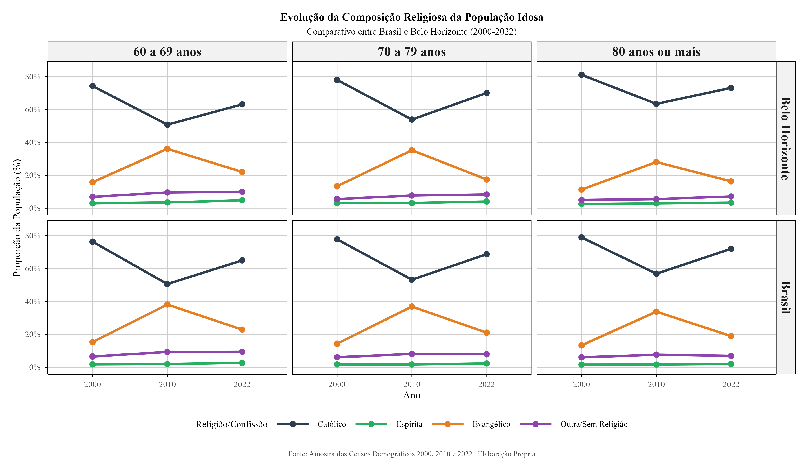

La composición religiosa de las personas mayores varía por edad, territorio y año censal. En los modelos generales para Belo Horizonte, el sexo femenino se asoció positivamente con la realización de desplazamientos religiosos y la dificultad para caminar se asoció negativamente. Estas son asociaciones condicionadas por el modelo, no efectos causales.

{fig-alt="Evolución de la composición religiosa de las personas mayores"}
