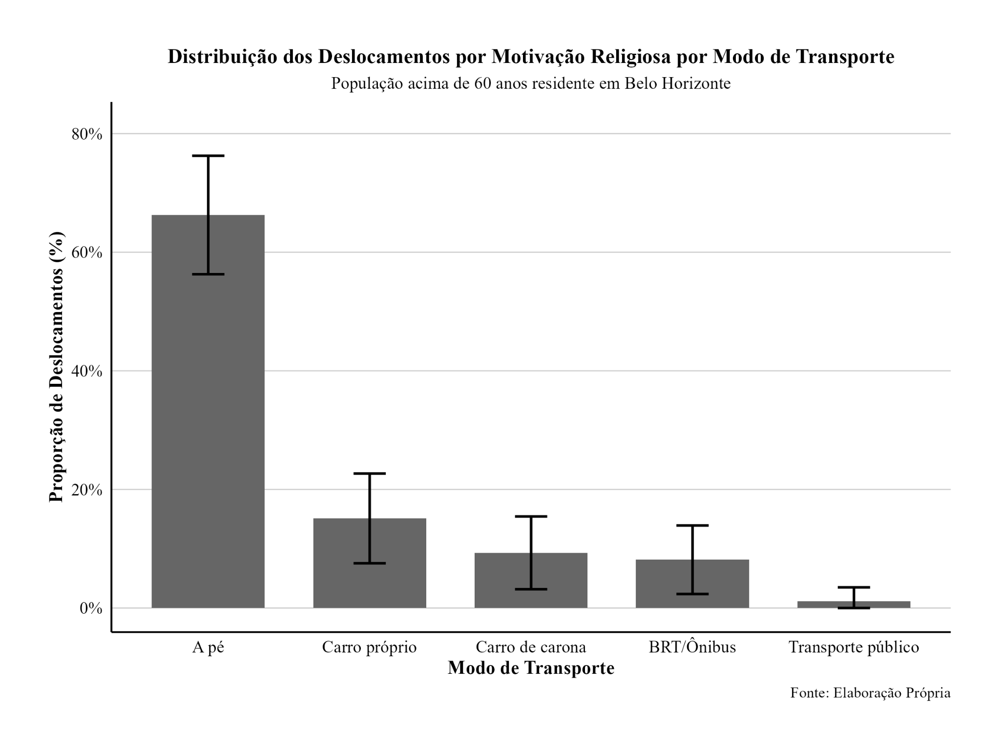
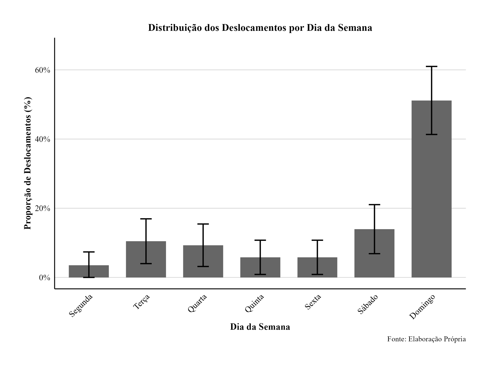
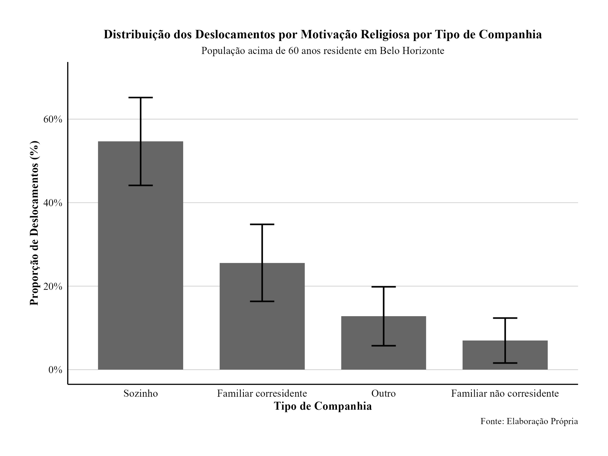
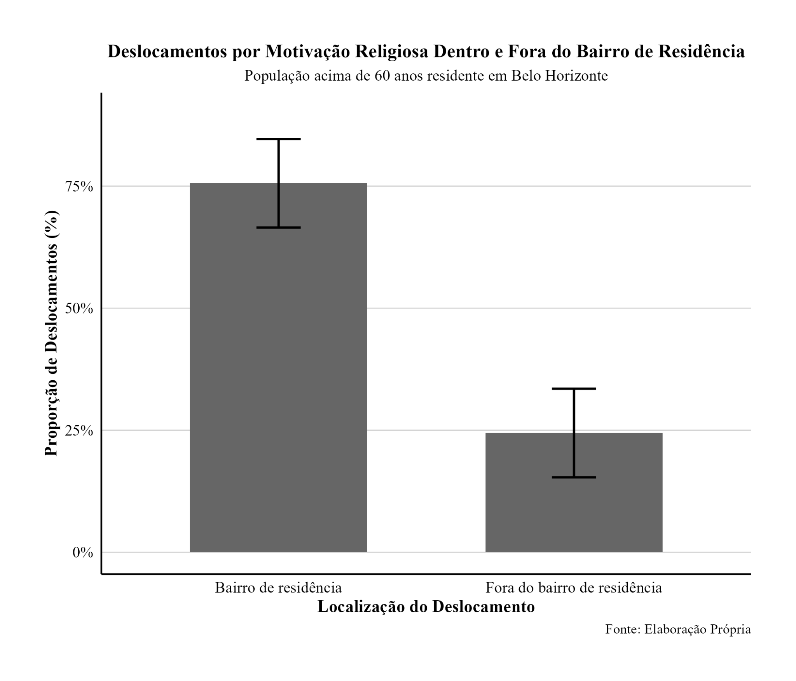
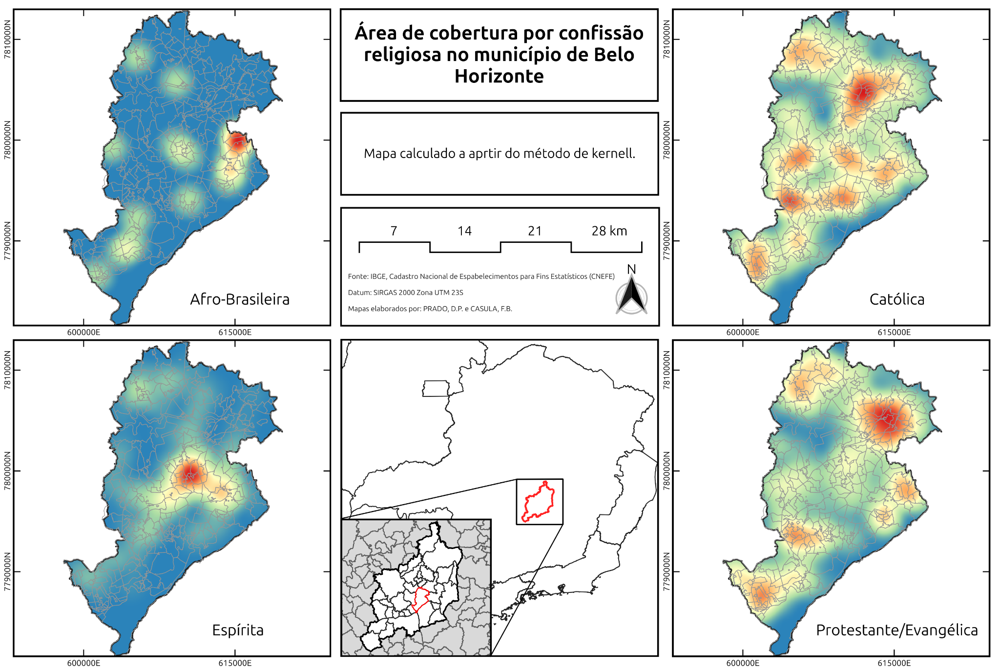
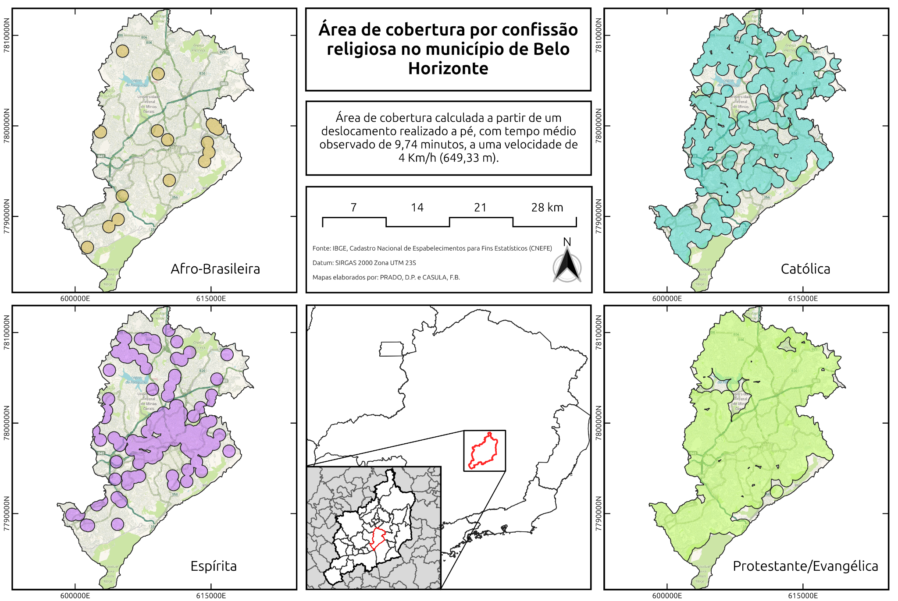

## Síntesis de los desplazamientos religiosos

Entre los 86 desplazamientos por motivos religiosos observados para residentes de Belo Horizonte, predominan los viajes realizados **los domingos**, **a pie**, frecuentemente **sin compañía** y con destino localizado **en el propio barrio de residencia**.

<figure>

</figure>
<figure>

</figure>
<figure>

</figure>
<figure>

</figure>

::: {.callout-note collapse="true"}
## Abrir tablas detalladas de frecuencia

### Día de la semana

| Día | n | Proporción | IC 95% |
|---|---:|---:|---:|
| Lunes | 3 | 3,49% | 0,00%–7,37% |
| Martes | 9 | 10,47% | 3,99%–16,94% |
| Miércoles | 8 | 9,30% | 3,16%–15,44% |
| Jueves | 5 | 5,81% | 0,86%–10,77% |
| Viernes | 5 | 5,81% | 0,86%–10,77% |
| Sábado | 12 | 13,95% | 6,63%–21,28% |
| Domingo | 44 | 51,16% | 40,60%–61,73% |

### Compañía

| Tipo de compañía | n | Proporción | IC 95% |
|---|---:|---:|---:|
| Solo(a) | 47 | 54,65% | 44,13%–65,17% |
| Familiar corresidente | 22 | 25,58% | 16,36%–34,80% |
| Otro | 11 | 12,79% | 5,73%–19,85% |
| Familiar no corresidente | 6 | 6,98% | 1,60%–12,35% |

### Modo y tiempo de desplazamiento

| Modo | n | Proporción | IC 95% | Tiempo medio (min) | IC 95% del tiempo |
|---|---:|---:|---:|---:|---:|
| A pie | 57 | 66,28% | 56,29%–76,27% | 9,7 | 8,2–11,3 |
| Automóvil propio | 13 | 15,12% | 7,54%–22,69% | 8,6 | 5,64–11,58 |
| Automóvil compartido | 8 | 9,30% | 3,16%–15,44% | — | — |
| BRT/Autobús | 7 | 8,14% | 2,36%–13,92% | — | — |
| Transporte público | 1 | 1,16% | 0,00%–3,44% | — | — |

El tiempo medio considerando todos los modos fue de **12,8 minutos** (IC 95%: 10,4–15,2).

### Localización del destino

| Localización | n | Proporción | IC 95% |
|---|---:|---:|---:|
| Barrio de residencia | 65 | 75,58% | 66,50%–84,70% |
| Fuera del barrio de residencia | 21 | 24,42% | 15,30%–33,50% |
:::

## Modelos de regresión logística

En los modelos para Belo Horizonte, el sexo femenino presentó asociación positiva con los desplazamientos religiosos. En el modelo general para al menos un desplazamiento, las mujeres presentaron OR de **3,914** (IC 95%: 1,685–9,837). La movilidad reducida presentó OR de **0,256** (IC 95%: 0,091–0,642).

::: {.callout-note collapse="true"}
## Abrir resultados detallados de las regresiones — Belo Horizonte

Los valores son razones de posibilidades; los intervalos de confianza de 95% aparecen entre corchetes. `+ p < 0,1`; `* p < 0,05`; `** p < 0,01`; `*** p < 0,001`.

### Al menos un desplazamiento religioso durante la semana

::: {.table-scroll .table-compact}
| Variable | Demográfico | Sociodemográfico | General |
|---|---:|---:|---:|
| Intercepto | 1,044 [0,018–64,040] | 0,765 [0,010–62,205] | 1,114 [0,014–103,386] |
| Edad | 0,966 [0,913–1,018] | 0,972 [0,917–1,027] | 0,975 [0,918–1,032] |
| Sexo femenino | 3,527** [1,602–8,336] | 3,512** [1,557–8,546] | 3,914** [1,685–9,837] |
| Raza: negros | 1,780 [0,831–3,987] | 1,600 [0,706–3,783] | 1,623 [0,694–3,963] |
| Estado civil: separado(a) | 0,473 [0,082–2,357] | 0,424 [0,073–2,119] | 0,417 [0,070–2,149] |
| Estado civil: casado(a) | 1,027 [0,333–3,602] | 1,036 [0,335–3,638] | 0,949 [0,290–3,472] |
| Estado civil: viudo(a) | 1,479 [0,444–5,507] | 1,440 [0,427–5,419] | 1,573 [0,441–6,284] |
| Ingreso: R$ 1.620–2.600 | — | 0,835 [0,275–2,377] | 0,589 [0,181–1,775] |
| Ingreso: R$ 2.300–4.600 | — | 1,303 [0,469–3,578] | 0,866 [0,288–2,540] |
| Ingreso: más de R$ 4.600 | — | 0,579 [0,179–1,714] | 0,392 [0,113–1,239] |
| Movilidad reducida | — | — | 0,256** [0,091–0,642] |
:::

### Dos o más desplazamientos religiosos durante la semana

::: {.table-scroll .table-compact}
| Variable | Demográfico | Sociodemográfico | General |
|---|---:|---:|---:|
| Intercepto | 0,012 [0,000–3,751] | 0,061 [0,000–32,316] | 0,122 [0,000–88,267] |
| Edad | 0,995 [0,923–1,069] | 0,980 [0,905–1,057] | 0,979 [0,898–1,061] |
| Sexo femenino | 3,671* [1,197–13,867] | 3,350+ [1,045–13,184] | 3,482+ [1,029–14,336] |
| Raza: negros | 2,901+ [0,959–10,863] | 2,764 [0,814–11,498] | 2,823 [0,781–12,383] |
| Estado civil: separado(a) | 1,100 [0,040–30,313] | 1,188 [0,041–34,609] | 1,411 [0,047–43,178] |
| Estado civil: casado(a) | 2,991 [0,491–58,109] | 2,609 [0,402–51,978] | 2,310 [0,323–47,752] |
| Estado civil: viudo(a) | 3,508 [0,538–69,430] | 3,311 [0,489–66,523] | 4,178 [0,551–89,789] |
| Ingreso: R$ 1.620–2.600 | — | 0,193 [0,010–1,138] | 0,126+ [0,006–0,802] |
| Ingreso: R$ 2.300–4.600 | — | 0,404 [0,057–1,842] | 0,243 [0,032–1,203] |
| Ingreso: más de R$ 4.600 | — | 0,896 [0,205–3,501] | 0,586 [0,123–2,470] |
| Movilidad reducida | — | — | 0,178* [0,035–0,664] |
:::

### Indicadores de ajuste

| Desenlace | Modelo | n | AIC | Log-verosimilitud | Pseudo-R² de McFadden |
|---|---|---:|---:|---:|---:|
| ≥1 desplazamiento | Demográfico | 182 | 191,5 | −88,763 | 0,086 |
| ≥1 desplazamiento | Sociodemográfico | 182 | 195,6 | −87,814 | 0,096 |
| ≥1 desplazamiento | General | 182 | 188,9 | −83,428 | 0,141 |
| ≥2 desplazamientos | Demográfico | 182 | 120,2 | −53,120 | 0,095 |
| ≥2 desplazamientos | Sociodemográfico | 182 | 122,3 | −51,137 | 0,129 |
| ≥2 desplazamientos | General | 182 | 117,4 | −47,679 | 0,188 |
:::

## Equipamientos religiosos y cobertura

Los establecimientos fueron identificados en el CNEFE 2022. Después de la clasificación inicial, **622 registros fueron revisados manualmente**. Los 483 registros descritos solamente como “IGREJA” fueron censurados, resultando en 3.848 puntos clasificados.

| Confesión | Establecimientos | Participación | Cobertura poblacional | ICR |
|---|---:|---:|---:|---:|
| Protestante/Evangélica | 3.326 | 86,4% | 2.277.951 | 98,4% |
| Católica | 296 | 7,7% | 1.793.976 | 77,5% |
| Espírita | 154 | 4,0% | 974.622 | 42,1% |
| Afrobrasileña | 17 | 0,4% | 198.386 | 8,5% |
| Otra | 55 | 1,4% | — | — |

## Concentración espacial de los equipamientos — kernel

{fig-alt="Mapa original en portugués: kernel por confesión religiosa"}

## Área de cobertura por confesión

{fig-alt="Mapa original en portugués: área de cobertura por confesión religiosa"}

[Abrir el ICR interactivo](../indice-cobertura.qmd){.btn .btn-primary}
[Ver presentación en español](presentacion-es.qmd){.btn .btn-outline-primary}
