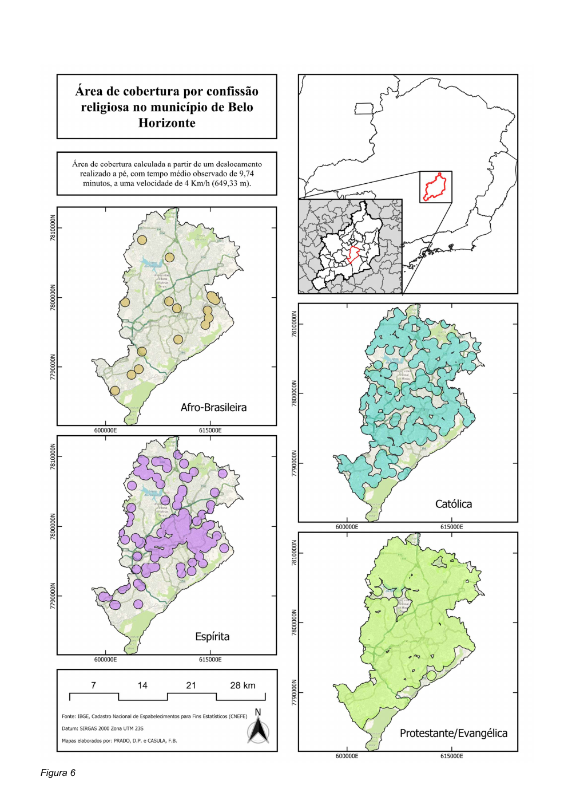
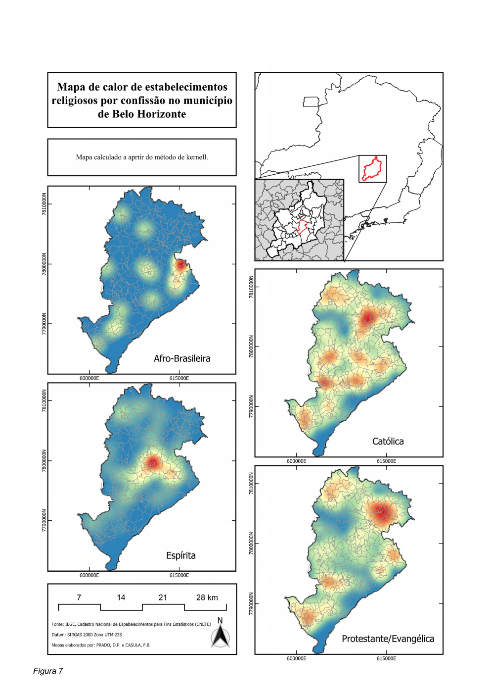

```{r}
#| label: setup-equipment
library(readr); library(dplyr); library(scales)
pub <- read_csv("data/derived/estabelecimentos_publicacao.csv", show_col_types=FALSE)
cur <- read_csv("data/derived/estabelecimentos_classificacao_atual.csv", show_col_types=FALSE)
icr <- read_csv("data/derived/icr_publicacao.csv", show_col_types=FALSE)
```

## Distribuição por confissão

A tabela congelada da apresentação atribui 86,4% dos estabelecimentos à categoria Protestante/Evangélica. A atualização da base categorizada mantém o mesmo universo total de 3.848 pontos, mas redistribui parte das observações entre as confissões. Por transparência, os dois estados são preservados.

```{r}
#| label: tbl-classification
#| tbl-cap: "Distribuição dos estabelecimentos: versão da publicação e classificação atual."
full_join(pub |> select(confissao, publicacao_n=estabelecimentos), cur |> select(confissao, atual_n=estabelecimentos), by="confissao") |>
  mutate(diferenca=atual_n-publicacao_n) |>
  knitr::kable()
```

## Cobertura publicada

```{r}
#| label: tbl-icr-published
#| tbl-cap: "Cobertura populacional e ICR apresentados no trabalho original."
icr |>
  transmute(Confissão=confissao, `População coberta`=format(populacao_coberta_publicacao,big.mark=".",decimal.mark=","), ICR=percent(icr_publicacao,accuracy=.1)) |>
  knitr::kable(align=c("l","r","r"))
```

A categoria Católica apresenta cobertura muito superior ao que seria sugerido apenas por sua participação no número de estabelecimentos. Isso evidencia que distribuição territorial e quantidade absoluta não são medidas intercambiáveis.

## Cartografia original

A publicação reúne mapas de cobertura e de concentração por kernel. No projeto reprodutível, esses produtos são tratados como resultados históricos, enquanto a página interativa recalcula a cobertura com parâmetros explícitos.

::: {.columns}
::: {.column width="50%"}
{fig-alt="Mapa original das áreas de cobertura por confissão"}
:::
::: {.column width="50%"}
{fig-alt="Mapa de calor original dos estabelecimentos por confissão"}
:::
:::

[Consultar a publicação completa](assets/publication/TrabalhoALAS_merged.pdf){.btn .btn-outline-primary}

::: {.audit-note}
**Versão dos dados.** A classificação atual do CSV fornecido não reproduz exatamente a distribuição por confissão da tabela do manuscrito, embora reproduza o total de 3.848 pontos após a exclusão da descrição genérica “IGREJA”. A divergência foi documentada em `data/validation/reconciliacao_metodologica.csv`.
:::
